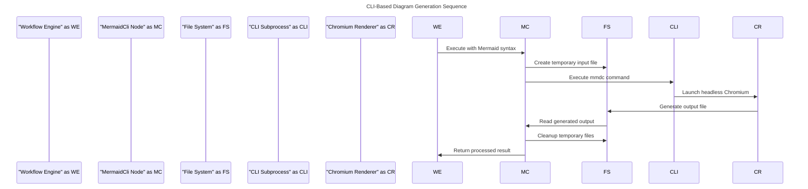
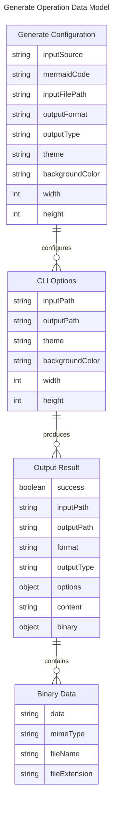
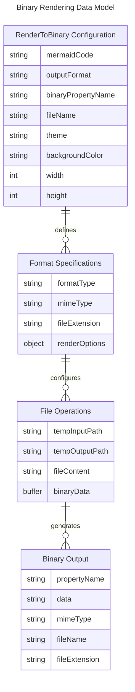
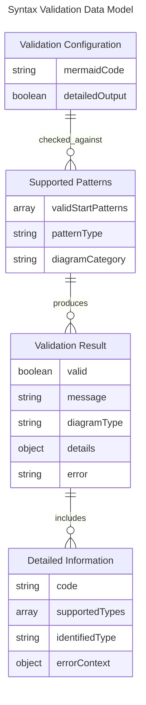
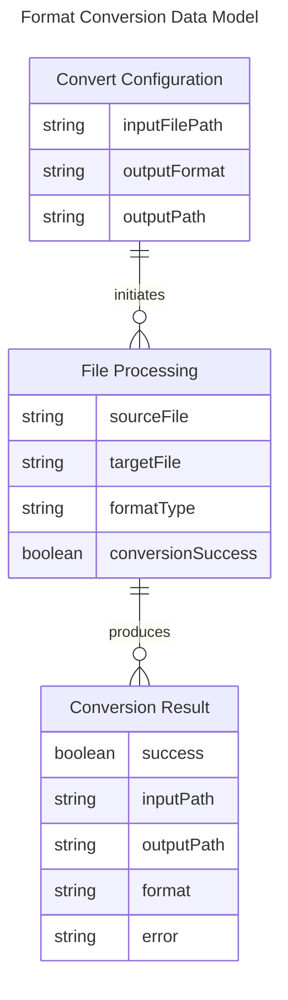
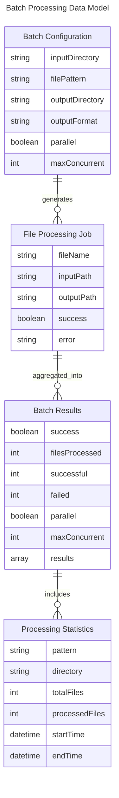
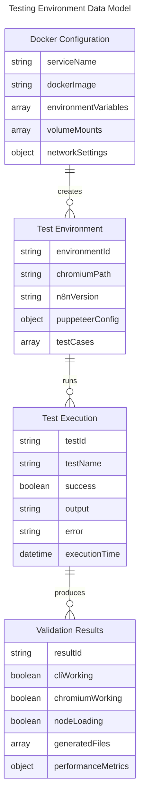

## n8n Mermaid CLI Node Project

**project directories**
- nodes/MermaidCLI/ - Custom MermaidCli n8n node implementation with 5 operations
- n8n_test_env/ - Docker testing environment with Chromium browser support
- dist/ - Compiled JavaScript output and packaged assets

This project provides a single comprehensive n8n node called MermaidCli that enables Mermaid diagram generation within n8n workflows through CLI subprocess execution. The node supports 5 operations: generate diagrams, render to binary data, validate syntax, convert formats, and batch process multiple files. It uses @mermaid-js/mermaid-cli with Chromium rendering for reliable diagram generation in multiple output formats (PNG, SVG, PDF).

## USE-CASE: CLI-Based Diagram Generation

**Feature 1: Generate Operation - Multiple Output Modes**

|| definition |
|--|--|
| GIVEN | A workflow contains Mermaid syntax as text or file path with output configuration |
| WHEN | The MermaidCli node execute with 'generate' operation and specified output type |
| THEN | A diagram is generated via CLI subprocess and delivered as file content, binary data, or file path |

**State Diagram: Logic flow within feature**

The state diagram shows how the MermaidCli node processes generate operations through CLI subprocess execution with multiple output delivery modes.

```mermaid
---
title: Generate Operation Processing States
---
stateDiagram-v2
    [*] --> "Input Source Selection"
    "Input Source Selection" --> "Text Input Processing" : Text Source
    "Input Source Selection" --> "File Path Processing" : File Source
    "Text Input Processing" --> "Temporary File Creation"
    "File Path Processing" --> "CLI Argument Construction"
    "Temporary File Creation" --> "CLI Argument Construction"
    "CLI Argument Construction" --> "Subprocess Execution"
    "Subprocess Execution" --> "Output Type Processing"
    "Output Type Processing" --> "File Content Return" : fileContent Mode
    "Output Type Processing" --> "Binary Data Return" : binary Mode
    "Output Type Processing" --> "File Path Return" : filePath Mode
    "File Content Return" --> [*]
    "Binary Data Return" --> [*]
    "File Path Return" --> [*]
```

**Sequence Diagram: Interactions between systems to enable Feature**

The sequence diagram illustrates how the MermaidCli node executes CLI subprocess operations for diagram generation.



**Data Entity Relationship: Data structure for entities in Feature**

The entity relationship diagram shows the data structures used for CLI-based diagram generation configuration and output processing.



## USE-CASE: Binary Data Rendering

**Feature 1: RenderToBinary Operation - Direct Binary Output**

|| definition |
|--|--|
| GIVEN | Workflow needs diagram data as binary attachments for email, file storage, or API transmission |
| WHEN | The MermaidCli node executes with 'renderToBinary' operation and format configuration |
| THEN | A diagram is generated and returned as binary data with proper MIME type and filename |

**State Diagram: Logic flow within feature**

The state diagram shows the specific processing steps for binary rendering including format handling and MIME type assignment.

```mermaid
---
title: Binary Rendering Processing Flow
---
stateDiagram-v2
    [*] --> "Binary Operation Input"
    "Binary Operation Input" --> "Format Selection"
    "Format Selection" --> "Temporary File Setup"
    "Temporary File Setup" --> "CLI Subprocess Execution"
    "CLI Subprocess Execution" --> "Binary File Reading"
    "Binary File Reading" --> "MIME Type Assignment"
    "MIME Type Assignment" --> "Base64 Encoding"
    "Base64 Encoding" --> "Binary Data Package"
    "Binary Data Package" --> [*]
```

**Sequence Diagram: Interactions between systems to enable Feature**

Shows how the renderToBinary operation interacts with the file system and CLI to produce binary attachments.

```mermaid
---
title: Binary Data Rendering Process
---
flowchart TD
    "Mermaid Code Input" --> "RenderToBinary Operation"
    "RenderToBinary Operation" --> "Temporary File Creator"
    "Temporary File Creator" --> "CLI Subprocess Manager"
    "CLI Subprocess Manager" --> "Chromium Renderer"
    "Chromium Renderer" --> "Binary File Reader"
    "Binary File Reader" --> "MIME Type Processor"
    "MIME Type Processor" --> "Base64 Encoder"
    "Base64 Encoder" --> "Binary Data Output"
```

**Data Entity Relationship: Data structure for entities in Feature**

Data structures specific to binary rendering including MIME type mapping and binary data packaging.



## USE-CASE: Syntax Validation and Quality Assurance

**Feature 1: Validate Operation - Mermaid Syntax Checking**

|| definition |
|--|--|
| GIVEN | Workflow contains Mermaid syntax that needs validation before processing or rendering |
| WHEN | The MermaidCli node executes with 'validate' operation and detailed output configuration |
| THEN | The syntax is checked against supported diagram types and validation results are returned |

**State Diagram: Logic flow within feature**

The state diagram shows how syntax validation processes Mermaid code through pattern matching and error detection.

```mermaid
---
title: Syntax Validation Processing Flow
---
stateDiagram-v2
    [*] --> "Validation Input"
    "Validation Input" --> "Code Trimming"
    "Code Trimming" --> "Pattern Matching"
    "Pattern Matching" --> "Valid Syntax" : Recognized Pattern
    "Pattern Matching" --> "Invalid Syntax" : Unknown Pattern
    "Valid Syntax" --> "Detailed Analysis"
    "Invalid Syntax" --> "Error Reporting"
    "Detailed Analysis" --> "Validation Success"
    "Error Reporting" --> "Validation Failure"
    "Validation Success" --> [*]
    "Validation Failure" --> [*]
```

**Sequence Diagram: Interactions between systems to enable Feature**

Shows how syntax validation processes input without requiring CLI subprocess execution.

```mermaid
---
title: Syntax Validation Process
---
flowchart TD
    "Mermaid Code Input" --> "Validate Operation"
    "Validate Operation" --> "Syntax Pattern Checker"
    "Syntax Pattern Checker" --> "Diagram Type Identifier"
    "Diagram Type Identifier" --> "Validation Result Generator"
    "Validation Result Generator" --> "Detailed Output Formatter"
    "Detailed Output Formatter" --> "Validation Response"
```

**Data Entity Relationship: Data structure for entities in Feature**

Data structures for syntax validation including supported patterns and validation results.



## USE-CASE: Format Conversion and File Processing

**Feature 1: Convert Operation - Diagram Format Transformation**

|| definition |
|--|--|
| GIVEN | Existing diagram files need to be converted to different output formats |
| WHEN | The MermaidCli node executes with 'convert' operation specifying input and output paths |
| THEN | The diagram file is processed through CLI and converted to the target format |

**State Diagram: Logic flow within feature**

The state diagram shows the processing flow for converting existing diagram files to new formats.

```mermaid
---
title: Format Conversion Processing Flow
---
stateDiagram-v2
    [*] --> "Convert Operation Input"
    "Convert Operation Input" --> "Input File Validation"
    "Input File Validation" --> "Output Format Selection"
    "Output Format Selection" --> "CLI Conversion Execution"
    "CLI Conversion Execution" --> "Output File Generation"
    "Output File Generation" --> "Conversion Success"
    "Conversion Success" --> [*]
```

**Sequence Diagram: Interactions between systems to enable Feature**

Shows how format conversion processes existing files through CLI transformation.

```mermaid
---
title: Format Conversion Process
---
flowchart TD
    "Input File Path" --> "Convert Operation"
    "Convert Operation" --> "File Existence Checker"
    "File Existence Checker" --> "CLI Subprocess Manager"
    "CLI Subprocess Manager" --> "Format Converter"
    "Format Converter" --> "Output File Generator"
    "Output File Generator" --> "Conversion Result"
```

**Data Entity Relationship: Data structure for entities in Feature**

Data structures for format conversion operations and file processing.



## USE-CASE: Batch Processing and Workflow Automation

**Feature 1: Batch Operation - Multiple File Processing**

|| definition |
|--|--|
| GIVEN | A directory contains multiple Mermaid files that need processing in bulk |
| WHEN | The MermaidCli node executes with 'batch' operation specifying directory patterns and processing options |
| THEN | All matching files are processed either sequentially or in parallel with configurable concurrency |

**State Diagram: Logic flow within feature**

The state diagram shows the batch processing lifecycle from file discovery to completion reporting.

```mermaid
---
title: Batch Processing Lifecycle
---
stateDiagram-v2
    [*] --> "Batch Operation Input"
    "Batch Operation Input" --> "Directory Scanning"
    "Directory Scanning" --> "Pattern Matching"
    "Pattern Matching" --> "File List Generation"
    "File List Generation" --> "Processing Mode Selection"
    "Processing Mode Selection" --> "Sequential Processing" : Sequential Mode
    "Processing Mode Selection" --> "Parallel Processing" : Parallel Mode
    "Sequential Processing" --> "File Processing Loop"
    "Parallel Processing" --> "Concurrent Execution"
    "File Processing Loop" --> "Results Aggregation"
    "Concurrent Execution" --> "Results Aggregation"
    "Results Aggregation" --> "Batch Completion"
    "Batch Completion" --> [*]
```

**Sequence Diagram: Interactions between systems to enable Feature**

Shows how batch processing manages multiple file operations with optional parallelization.

```mermaid
---
title: Batch Processing Flow
---
flowchart TD
    "Input Directory" --> "Batch Operation"
    "Batch Operation" --> "File Pattern Matcher"
    "File Pattern Matcher" --> "Processing Strategy Selector"
    "Processing Strategy Selector" --> "Sequential Processor"
    "Processing Strategy Selector" --> "Parallel Processor"
    "Sequential Processor" --> "Individual File Processor"
    "Parallel Processor" --> "Concurrent File Processor"
    "Individual File Processor" --> "Results Collector"
    "Concurrent File Processor" --> "Results Collector"
    "Results Collector" --> "Batch Summary Generator"
```

**Data Entity Relationship: Data structure for entities in Feature**

Data structures for batch processing configuration and result tracking.



## USE-CASE: Development Environment and Testing Infrastructure

**Feature 1: Docker-based Testing Environment with Chromium Support**

|| definition |
|--|--|
| GIVEN | Developers need to test MermaidCli node functionality with proper Chromium rendering dependencies |
| WHEN | The Docker testing environment is launched with n8n service and Chromium browser support |
| THEN | A complete testing environment is available for validating CLI subprocess execution and diagram generation |

**State Diagram: Logic flow within feature**

The state diagram shows the testing environment setup and validation process for the MermaidCli node.

```mermaid
---
title: Testing Environment Lifecycle
---
stateDiagram-v2
    [*] --> "Docker Environment Setup"
    "Docker Environment Setup" --> "Chromium Installation"
    "Chromium Installation" --> "n8n Service Configuration"
    "n8n Service Configuration" --> "MermaidCli Node Loading"
    "MermaidCli Node Loading" --> "Test Workflow Creation"
    "Test Workflow Creation" --> "CLI Subprocess Testing"
    "CLI Subprocess Testing" --> "Diagram Generation Validation"
    "Diagram Generation Validation" --> "Test Results Analysis"
    "Test Results Analysis" --> [*]
```

**Sequence Diagram: Interactions between systems to enable Feature**

Shows how the testing environment integrates Docker, n8n, and Chromium for comprehensive node testing.

```mermaid
---
title: Testing Environment Integration
---
flowchart TD
    "Docker Compose" --> "Container Orchestration"
    "Container Orchestration" --> "Chromium Browser Setup"
    "Chromium Browser Setup" --> "n8n Service Launch"
    "n8n Service Launch" --> "MermaidCli Node Registration"
    "MermaidCli Node Registration" --> "Test Workflow Execution"
    "Test Workflow Execution" --> "CLI Subprocess Validation"
    "CLI Subprocess Validation" --> "Output Verification"
    "Output Verification" --> "Test Results Report"
```

**Data Entity Relationship: Data structure for entities in Feature**

Data structures for testing environment configuration and validation results.


