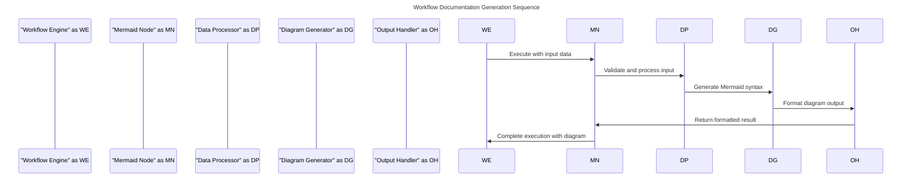
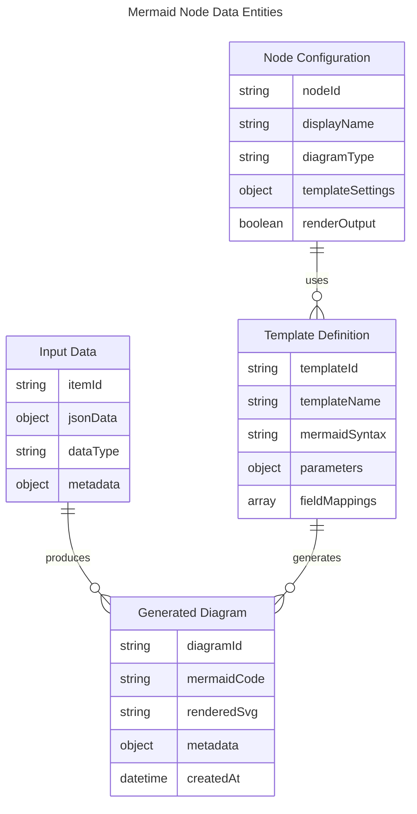
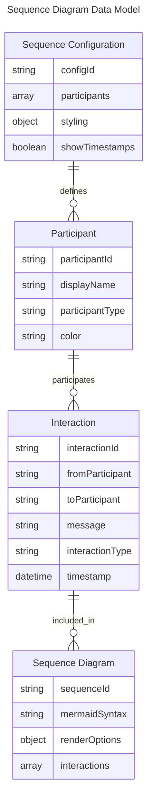
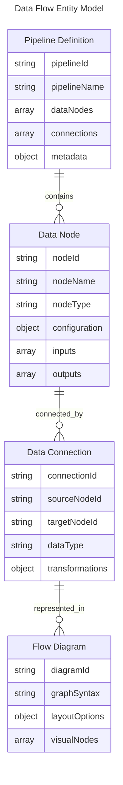
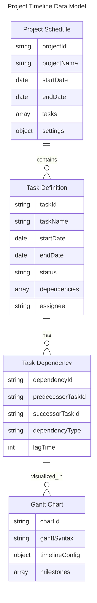
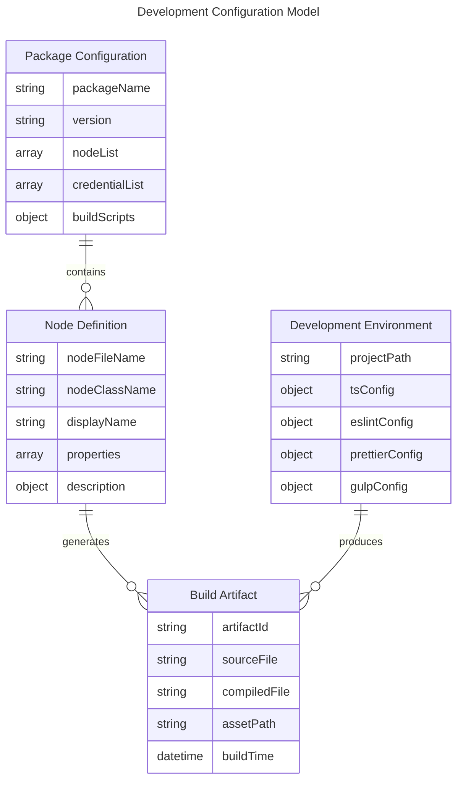
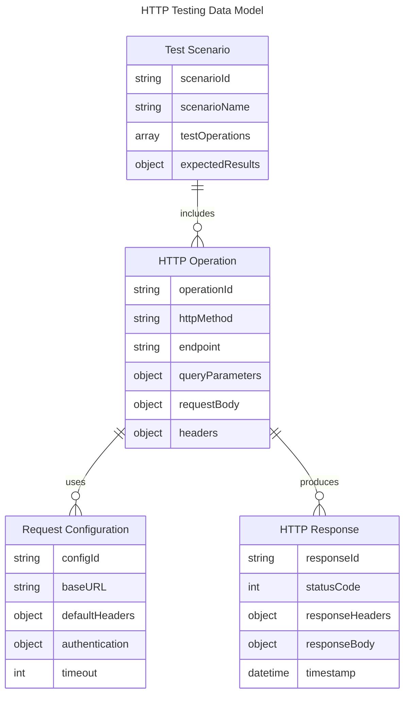

## n8n Mermaid Nodes Project

**project directories**
- nodes/ - Custom n8n node implementations for Mermaid diagram generation
- credentials/ - Authentication credential definitions for external services
- dist/ - Compiled JavaScript output and packaged assets

This project provides custom n8n nodes that enable Mermaid diagram generation within n8n workflows. The nodes allow users to create flowcharts, sequence diagrams, Gantt charts, and other diagram types by processing workflow data and generating Mermaid syntax or rendered diagrams.

## USE-CASE: Automated Workflow Documentation Generation

**Feature 1: Flowchart Creation from Workflow Data**

|| definition |
|--|--|
| GIVEN | A workflow contains data about process steps, decisions, and connections |
| WHEN | The Mermaid Flowchart node processes this data with user-defined templates |
| THEN | A Mermaid flowchart diagram is generated showing the process flow visualization |

**State Diagram: Logic flow within feature**

The state diagram shows how the Mermaid node processes input data through validation, template application, and diagram generation stages.

```mermaid
---
title: Mermaid Node Processing States
---
stateDiagram-v2
    [*] --> "Input Received"
    "Input Received" --> "Data Validation"
    "Data Validation" --> "Template Selection" : Valid Data
    "Data Validation" --> "Error State" : Invalid Data
    "Template Selection" --> "Mermaid Syntax Generation"
    "Mermaid Syntax Generation" --> "Diagram Rendering"
    "Diagram Rendering" --> "Output Preparation"
    "Output Preparation" --> [*]
    "Error State" --> [*]
```

**Sequence Diagram: Interactions between systems to enable Feature**

The sequence diagram illustrates how the n8n workflow engine interacts with the Mermaid node to process data and generate diagrams.



**Data Entity Relationship: Data structure for entities in Feature**

The entity relationship diagram shows the data structures used for storing diagram configuration, input data, and generated outputs.



## USE-CASE: Dynamic Sequence Diagram Creation

**Feature 1: API Interaction Visualization**

|| definition |
|--|--|
| GIVEN | Workflow data contains API call sequences, responses, and timing information |
| WHEN | The Mermaid Sequence Diagram node processes this data with participant mapping |
| THEN | A sequence diagram is generated showing the API interaction flow between services |

**State Diagram: Logic flow within feature**

The state diagram shows the specific processing steps for sequence diagram generation including participant identification and interaction mapping.

```mermaid
---
title: Sequence Diagram Generation Flow
---
stateDiagram-v2
    [*] --> "Input Processing"
    "Input Processing" --> "Participant Identification"
    "Participant Identification" --> "Interaction Mapping"
    "Interaction Mapping" --> "Sequence Ordering"
    "Sequence Ordering" --> "Mermaid Sequence Generation"
    "Mermaid Sequence Generation" --> "Diagram Output"
    "Diagram Output" --> [*]
```

**Sequence Diagram: Interactions between systems to enable Feature**

Shows how the sequence diagram node interacts with data sources and generates the final diagram output.

```mermaid
---
title: API Sequence Diagram Generation
---
flowchart TD
    "API Call Data" --> "Sequence Node"
    "Sequence Node" --> "Participant Extractor"
    "Participant Extractor" --> "Interaction Parser"
    "Interaction Parser" --> "Sequence Builder"
    "Sequence Builder" --> "Mermaid Syntax Generator"
    "Mermaid Syntax Generator" --> "Sequence Diagram Output"
```

**Data Entity Relationship: Data structure for entities in Feature**

Data structures specific to sequence diagram generation including participants, interactions, and timing information.



## USE-CASE: Data Flow Visualization

**Feature 1: Workflow Data Pipeline Mapping**

|| definition |
|--|--|
| GIVEN | Workflow contains data transformation steps, data sources, and output destinations |
| WHEN | The Mermaid Graph node processes this pipeline data with directional flow mapping |
| THEN | A graph diagram is generated showing the complete data flow from sources to destinations |

**State Diagram: Logic flow within feature**

The state diagram shows how data flow visualization processes pipeline information through node identification and connection mapping.

```mermaid
---
title: Data Flow Visualization States
---
stateDiagram-v2
    [*] --> "Pipeline Data Input"
    "Pipeline Data Input" --> "Source Node Identification"
    "Source Node Identification" --> "Transformation Mapping"
    "Transformation Mapping" --> "Destination Mapping"
    "Destination Mapping" --> "Flow Direction Calculation"
    "Flow Direction Calculation" --> "Graph Generation"
    "Graph Generation" --> "Flow Diagram Output"
    "Flow Diagram Output" --> [*]
```

**Sequence Diagram: Interactions between systems to enable Feature**

Shows the interaction flow for processing data pipeline information and generating flow diagrams.

```mermaid
---
title: Data Flow Diagram Generation Process
---
flowchart TD
    "Pipeline Metadata" --> "Flow Analysis Node"
    "Flow Analysis Node" --> "Node Classifier"
    "Node Classifier" --> "Connection Tracker"
    "Connection Tracker" --> "Flow Direction Mapper"
    "Flow Direction Mapper" --> "Graph Syntax Builder"
    "Graph Syntax Builder" --> "Data Flow Diagram"
```

**Data Entity Relationship: Data structure for entities in Feature**

Data structures for representing data pipeline components and their relationships in flow diagrams.



## USE-CASE: Project Timeline Visualization

**Feature 1: Gantt Chart Generation from Project Data**

|| definition |
|--|--|
| GIVEN | Workflow data contains project tasks, dates, dependencies, and resource assignments |
| WHEN | The Mermaid Gantt node processes this data with timeline configuration |
| THEN | A Gantt chart is generated showing project schedule and task dependencies |

**State Diagram: Logic flow within feature**

The state diagram shows the processing flow for converting project data into Gantt chart format.

```mermaid
---
title: Gantt Chart Generation Flow
---
stateDiagram-v2
    [*] --> "Project Data Input"
    "Project Data Input" --> "Task Extraction"
    "Task Extraction" --> "Date Validation"
    "Date Validation" --> "Dependency Analysis"
    "Dependency Analysis" --> "Timeline Calculation"
    "Timeline Calculation" --> "Gantt Syntax Generation"
    "Gantt Syntax Generation" --> "Chart Output"
    "Chart Output" --> [*]
```

**Sequence Diagram: Interactions between systems to enable Feature**

Shows how project timeline data is processed to create Gantt chart visualizations.

```mermaid
---
title: Project Timeline Visualization Flow
---
flowchart TD
    "Project Management Data" --> "Gantt Chart Node"
    "Gantt Chart Node" --> "Task Processor"
    "Task Processor" --> "Date Calculator"
    "Date Calculator" --> "Dependency Resolver"
    "Dependency Resolver" --> "Gantt Builder"
    "Gantt Builder" --> "Timeline Chart Output"
```

**Data Entity Relationship: Data structure for entities in Feature**

Data structures for project timeline information and Gantt chart generation.



## USE-CASE: Node Development and Testing

**Feature 1: Template Node to Mermaid Node Conversion**

|| definition |
|--|--|
| GIVEN | A developer has the example nodes (ExampleNode, HttpBin) as templates in the project |
| WHEN | The developer modifies these templates to implement Mermaid-specific functionality |
| THEN | New Mermaid nodes are created that can generate diagrams within n8n workflows |

**State Diagram: Logic flow within feature**

The state diagram shows the development lifecycle from template modification to production-ready Mermaid nodes.

```mermaid
---
title: Node Development Lifecycle
---
stateDiagram-v2
    [*] --> "Template Analysis"
    "Template Analysis" --> "Requirement Definition"
    "Requirement Definition" --> "Node Implementation"
    "Node Implementation" --> "TypeScript Compilation"
    "TypeScript Compilation" --> "ESLint Validation"
    "ESLint Validation" --> "Local Testing"
    "Local Testing" --> "Build Package"
    "Build Package" --> "npm Publishing"
    "npm Publishing" --> [*]
    "ESLint Validation" --> "Code Correction" : Validation Failed
    "Code Correction" --> "Node Implementation"
    "Local Testing" --> "Debug and Fix" : Tests Failed
    "Debug and Fix" --> "Node Implementation"
```

**Sequence Diagram: Interactions between systems to enable Feature**

Shows the interaction between development tools and build systems during node development.

```mermaid
---
title: Development Workflow Process
---
flowchart TD
    "Developer Code Changes" --> "TypeScript Compiler"
    "TypeScript Compiler" --> "ESLint Validator"
    "ESLint Validator" --> "Prettier Formatter"
    "Prettier Formatter" --> "Gulp Asset Processor"
    "Gulp Asset Processor" --> "Distribution Package"
    "Distribution Package" --> "Local n8n Testing"
    "Local n8n Testing" --> "npm Package Registry"
```

**Data Entity Relationship: Data structure for entities in Feature**

Data structures for development configuration and build artifacts.



## USE-CASE: HTTP Testing and API Integration

**Feature 1: HttpBin Node for Development Testing**

|| definition |
|--|--|
| GIVEN | Developers need to test HTTP operations and API integrations during Mermaid node development |
| WHEN | The HttpBin node is used in workflows to test HTTP GET, DELETE, and other operations |
| THEN | Developers can validate their node implementations against known HTTP endpoints |

**State Diagram: Logic flow within feature**

The state diagram shows how the HttpBin node processes different HTTP operations for testing purposes.

```mermaid
---
title: HttpBin Node Operation Flow
---
stateDiagram-v2
    [*] --> "Resource Selection"
    "Resource Selection" --> "Operation Selection"
    "Operation Selection" --> "Parameter Configuration"
    "Parameter Configuration" --> "HTTP Request Execution"
    "HTTP Request Execution" --> "Response Processing"
    "Response Processing" --> "Output Formatting"
    "Output Formatting" --> [*]
    "HTTP Request Execution" --> "Error Handling" : Request Failed
    "Error Handling" --> [*]
```

**Sequence Diagram: Interactions between systems to enable Feature**

Shows how the HttpBin node interacts with external HTTP services for testing purposes.

```mermaid
---
title: HTTP Testing Integration Flow
---
flowchart TD
    "n8n Workflow" --> "HttpBin Node"
    "HttpBin Node" --> "Parameter Processor"
    "Parameter Processor" --> "HTTP Request Builder"
    "HTTP Request Builder" --> "HttpBin API Service"
    "HttpBin API Service" --> "Response Handler"
    "Response Handler" --> "JSON Output Formatter"
    "JSON Output Formatter" --> "Next Workflow Node"
```

**Data Entity Relationship: Data structure for entities in Feature**

Data structures for HTTP testing operations and response handling.


